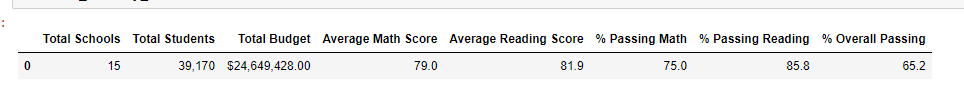
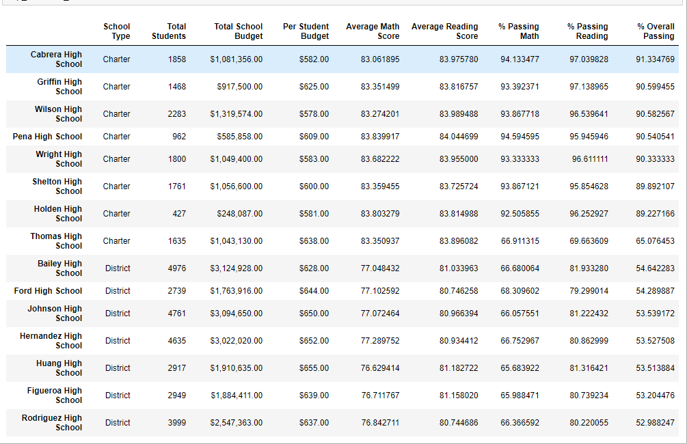
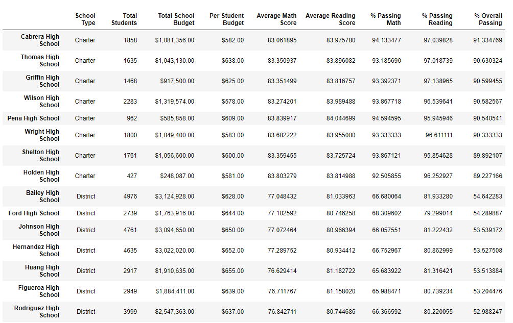

# School_District_Analysis
 
### Module 4 PyCitySchools Challenge 
**File:** [PyCitySchools Challenge](PyCitySchools_Challenge.ipynb)

## Overview of School District Analysis:
The purpose of this analysis is to confirm the hypothesis that the math and reading scores of the 9th graders at thomas high school are dragging down the performance of the school.

## School District Results:
**District Summary Before 9th graders from THS removed:**

**District Summary After 9th graders from THS removed:**

- From these results the 

**School Summary Before 9th graders from THS removed:**

**School Summary After 9th graders from THS removed:**

## School District Summary:
